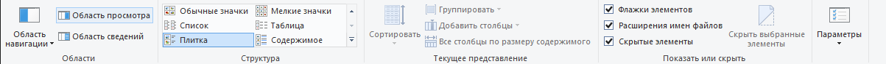
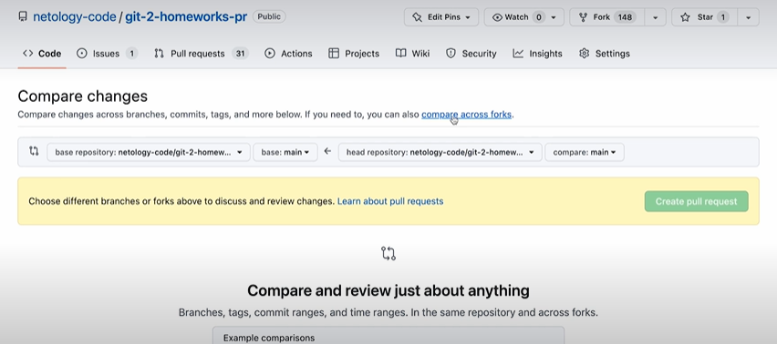

# Git / GitHub

## Подготовка к работе с Git: настройка файлов и папок. Установка и настройка редактора кода

Вкл. расширения и скрытые папки

Устанавливаем VSCode

Касательно языка разметки Markdown:

<ul>
    <li> Заголовки ставятся с помощью #;</li>
    <li> Ссылки вставляем используя синтаксис [<текст ссылки>](<сама ссылка>);</li>
    <li> Фотографии вставляем используя синтаксис .</li>
</ul>

Сейчас установим плагин, который будет помогать редактору читать markdown. Он называется 'Markdown All in One'

## Установка Git

Переходим на сайт git-scm.com -> Download for Windows -> Первая ссылка -> Устанавливаем. Там, где будет выбор Let Git decide и Override... выбираем второе. 

## Командная строка

Вкл. Git Bash

Узнаем версию Git:  

$ git --version

## Глобальные настройки Git

Настроим имя:  

$ git config --global user.name "<имя>"

Настроим e-mail:  

$ git config --global user.email "&lt;email&gt;"

Убедимся в корректности всех данных:  

$ git config --global --list

Для того, чтобы Git правильно распознавал строки, проделаем эти команды:  

<ul>
$ git config --global core.autocrlf true;  
$ git config --global core.safecrlf warn;  
$ git config --global core.quotepath off;  
</ul>

Установим стандартное название ветки 'main':  

$ git config --global init.defaultBranch main

Чтобы вызвать справку по гиту:  

$ git help -g

Справка по конкретной команде:  

$ git help <имя_команды>

## Создание локального репозитория в Git
Когда мы создаем файл и изменяем его, вверху у иконки появляется белая точка. Это означает, что изменения не сохранены и компьютер эти действия не запомнит. Сохраняем используя Ctrl + S. Также можно включать Auto save в настройках. 
Репозиторий - это папка, за которой следит Git
Откроем терминал для нашей папки: ПКМ по папке -> Показать доп. параметры -> Git Bash here
Для создания локального репозитория прописываем:  

$ git init

Эта команда создает локальный репозиторий на компьютере с помощью папки .git Если эту папку удалить, репозиторий превратится в обычную папку.
Чтобы посмотреть, какие файлы отслеживаются, а какие нет, используем:  

$ git status

Чтобы добавить файл в список отслеживаемых:  

$ git add README.md (для файла README.md например)

Чтобы добавить сразу все файлы:  

$ git add -A

После этого, изменения нужно закоммитить:  

$ git commit -m "<сообщение_коммита>"
## Работа с историей
Для того, чтобы посмотреть историю коммитов, используем:  

$ git log --oneline 
Теперь научимся исправлять ошибки в коммитах. Если мы допустили ошибку в названии коммита, можно воспользоваться следующей командой:  

$ git commit --amend -m "<правильное_название>"

Теперь допустим, что в коммит мы забыли добавить файл. Чтобы это исправить, добавляем файл в отслеживаемые и пишем:  

$ git commit --amend -m "<название_нового_коммита>"

Чтобы сразу добавить файл в отслеживаемые и закоммитить:  

$ git commit -a -m "<commit_message>"
## Путешествие по истории проекта
Для того, чтобы переместиться на коммит, пишем:  

$ git checkout <hash_of_commit>

Для того, чтобы посмотреть вообще всю историю проекта, пишем:  

$ git log --oneline --all

Также checkout можно использовать для перемещения по веткам:

$ git checkout <name_of_branch>

Чтобы создать новую ветку и сразу на нее переключиться:  

$ git checkout -b <name_of_new_branch>
## Работа с удаленным репозиторием через GitHub. Регистрация

После регистрации на GitHub необходимо сгенерировать SSH-ключ. Пишем в терминале:  

$ ssh-keygen

Далее копируем то, что идет после Your public key ... /.ssh/. Пишем в терминале cat ~/.ssh/id_...
Копируем то, что он выдал  
 Теперь в Github-е нажимаем на аватарку, settings -> SSH and GPG keys -> New SSH key -> любое название, вставляем ключ. -> Add SSH key
## Удаленный репозиторий на GitHub
Создаем репозиторий на сайте Github. В тексте на синем фоне нажимаем SSH и копируем ссылку. Нам нужно связать локальную папку с удаленным репозиторием. Открываем терминал для папки (в нашем случае это папка test). Пишем:  

$ git remote -v (проверяем, есть ли связи с удаленными репозиториями)

$ git remote add origin <ctrl+c> (связываем с удаленным репозиторием)

$ git remote -v (проверяем теперь)

Для того, чтобы отправить файлы на удаленный репозиторий, используем команду:  

$ git push -u origin main
## Fork и клонирование репозитория
На любом открытом репозитории гитхаба можно нажать кнопку Fork и скопировать его к себе в профиль. 
Чтобы склонировать репозиторий с удаленного на локальный, нужно перейти на удаленный репозиторий, скопировать SSH ссылку, написать в терминале:  

$ git clone <ctrl+c>
## Ветвление в Git
Для просмотра веток в проекте пишем:  

$ git branch

Чтобы создать новую ветку:  

$ git branch <name_of_new_branch>

Для перехода на другую ветку:  

$ git checkout <name_of_branch>

Чтобы сливать ветки друг с другом:  

$ git checkout main

$ git merge <name_of_merging_branch>
Чтобы разобраться с конфликтом: обязательно удаляем служебные символы, оставляем нужный вариант и коммитим изменения
## Обновление проекта

При загрузке изменений в проект нужно обновить версию проекта до актуальной, а именно прописать:  

$ git pull

У этой команды автоматически заложена последовательность выполнения следующих команд:  

$ git fetch - эта команда забирает изменения из удаленного репозитория и сохраняет их в промежуточном состоянии, не применяя к файлам на компьютере

$ git merge - сливает изменения в текущую ветку
## Работа с коммитами
Для отмены коммита можно использовать команду:  

$ git revert
## .gitignore
Можно прописать папки, которые будут игнорироваться гитом. Игнорироваться файл будет в том случае, если он написан в файле .gitignore и ни разу не был добавлен в отслеживаемые.
## Pull requests
Для код-ревью. Посмотрим как создавать пр в ситуации обладания всеми правами уд. репозитория:
Добавляем изменения в отдельную ветку -> pull requests -> new pull request -> create pull request .
Чтобы прямо в тексте пр-а ссылаться на ишью или другой пр , нужно знать их по номерам и писать #<номер_ишью>
Теперь рассмотрим ситуацию, что у нас нет прав доступа к изменению репозитория гх:
Fork -> вносим свои правки, коммитим и пушим -> Contribute -> open pull request
или:  

Fork -> вносим свои правки, коммитим и пушим -> сайт основного проекта, не нашего форка -> compare across forks -> выбираем свой форк -> create pull request ...

